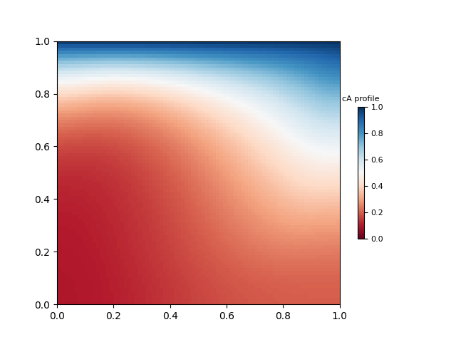

# Incompressible Navier-Stokes Solver using SIMPLE Algorithm with Scalar Transport and Reaction

This repository contains a **finite-volume method (FVM)** solver for the **2D incompressible Navier-Stokes equations**, extended to include **scalar transport and reaction**. The numerical method is based on the **SIMPLE algorithm** for pressure-velocity coupling, and supports multiple schemes for discretizing convection and diffusion terms. The solver is implemented in Python and designed for flexibility and clarity.

---

## Repository Structure

- **Solver Code**:  
  - `main.py`: Main script to run the simulation.  
  - `solver.py`: Contains all solver functions including pressure-velocity coupling using SIMPLE algorithm and scalar equation solvers.  
  - `user_setting.py`: Configure physical and numerical parameters.
  - `helpers.py`: helper functions for initializing and manipulating structured grid arrays used in the solver.

- **Post-processing**:  
  - `post_process.py`: Generates plots of the computed fields including the velocity streamlines, pressure and scalar profiles.
 - **Report**:  
  - `report.pdf`: Includes the derivation of the governing equations, numerical discretization, solver implementation details, and validation results for velocity and scalar fields.
---

## Required Packages

To run the code, the following Python packages are required:

- `numpy`: Array and numerical computations
- `matplotlib`: Plotting and visualizations
- `numba`: JIT compilation for speedup

---

## How to Run a Simulation

### 1. Configure Simulation Parameters

Edit `user_setting.py` to define:

- **Grid resolution**: `N_cells_x`, `N_cells_y` - Only simple rectangular grids with evenly spaced cells in both the x and y directions are supported.
- **Reynolds number**: `Re`
- **Reaction rate constant**: `reaction_rate_constant`
- **Error tolerance**: `tolerance`
- **Maximum iterations**: `maxit`
- **Halo cells**:  
  - `N_halo_x`, `N_halo_y` (halo width in x and y)
- **Relaxation factors**:  
  - `relaxation_factor_u`, `relaxation_factor_v`, `relaxation_factor_p`, `relaxation_factor_c`
- **Convection scheme**: `"UDS"`, `"QUICK"`, or `"Hybrid"`
- **Diffusion order**: `2` or `4`
- **Hybrid scheme**:  
  - `Hybrid_switch = True` to enable (only works with `UDS`)

### 2. Run the Simulation

Execute the main script:
```bash
python main.py
```

The solver will compute the velocity (`u`, `v`), pressure (`p`), and scalar concentrations (`cA`, `cB`) until convergence is reached.

Results are saved in the `sol` directory:
- `u.csv`, `v.csv`: Velocities on the staggered grid
- `uc.csv`, `vc.csv`: Velocities at pressure control volume centers
- `p.csv`: Pressure field
- `c.csv`, `c2.csv`: Scalar concentrations
- `alog.csv`: Residual log per iteration

---

### 3. Post-Process the Results

Generate plots using:

```bash
python post_process.py
```

This script will produce:
- **Velocity streamlines**
- **Concentration profiles**
- **Pressure contours**

Plots are saved in the `sol` directory.

---

## Sample Output

| Quantity              | Visualization                     |
|-----------------------|-----------------------------------|
| Velocity Streamlines  |  |
| Scalar Field (`c_A`)  |      |

---

## Additional Notes

- This solver includes scalar transport equations with source terms to model **reaction** or **mass transfer** between species.
- As an example, this solver includes scalar transport equations with a **reaction term**, modeling the irreversible conversion `A → B`. The reaction is implemented using a first-order rate law:

    ```
    r_A = -r_B = -k c_A
    ```

    where:
    - `c_A` is the concentration of species A
    - `k = 0.5` is the **reaction rate constant**
    - The diffusion coefficient is `D = 0.05`

- The scalar transport equation:

    ```
    ∇·(u c_i) - ∇·(D ∇c_i) + r_i = 0
- The structure is modular and extensible for multi-species or multi-phase extensions.
- Time discretization is steady-state, but the framework can be extended for unsteady cases.


## References

1. Patankar, S. V. (1980). *Numerical Heat Transfer and Fluid Flow*. McGraw-Hill.  
2. Versteeg, H. K., & Malalasekera, W. (2007). *An Introduction to Computational Fluid Dynamics: The Finite Volume Method*. Pearson Education.  
